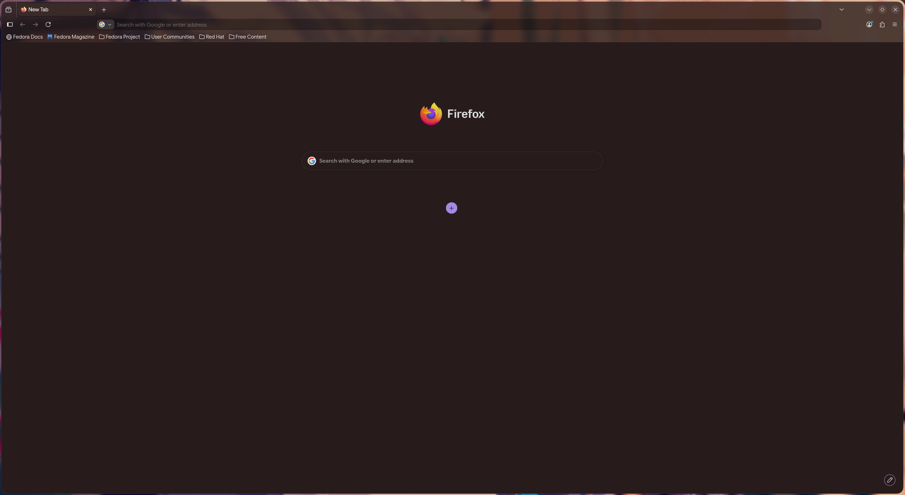
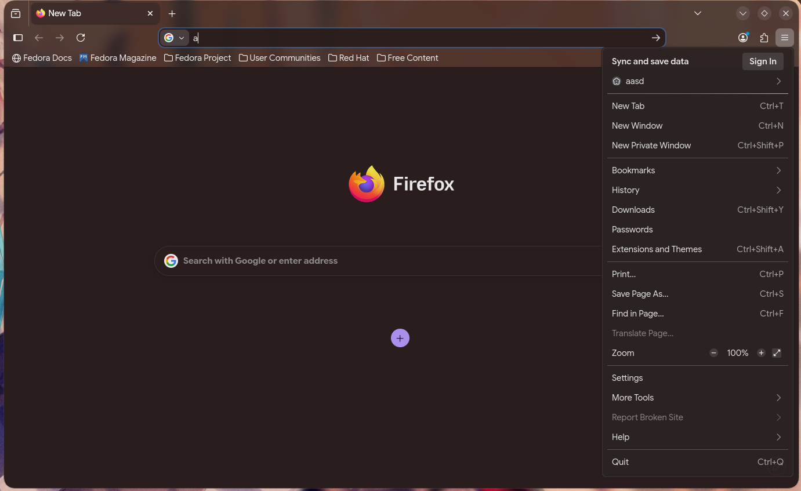

# Transparent-Firefox-Linux
Makes Firefox transparent with colored tint

A small transparent Firefox theme, for Linux(Maybe Windows if you can find a blur shader) while maintaining the browser's default layout.

## Requirements
1. Firefox Desktop 157.0 only
2. A Distro Compatible blur shader
     1. Hyprland's Built-in shader
     2. <a href="https://github.com/can1357/kde-blur"> KDE blur shader (untested) </a>

## Installation

1. Go to `about:config` and set `toolkit.legacyUserProfileCustomizations.stylesheets` to `true`
2. Find your profile folder via `about:profiles`
3. Download the contents of the `chrome` folder
4. Move the `chrome` folder to the Profile directory
5. (optional) move `disabled/removeContextMenuBloat.css` to `./enabled` for a leaner right-click menu
6. Edit `userChrome.css` `--theme:` variable with your desired R, G, B values. 
7. Restart Firefox
8. Configure your blur shader for prettier windows

## Examples

