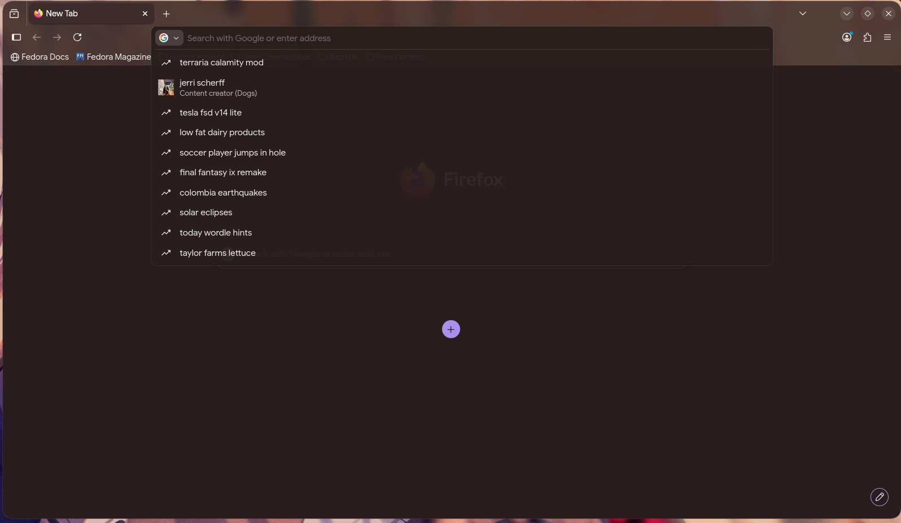

# Transparent-Firefox
Makes firefox transparent with colored tint
# Dynamic Firefox Theme

A minimal dark Firefox theme that dynamically colors the interface using the system's accent color (works on Windows, Linux and probably MacOS) while maintaining the browser's default layout and behavior.

## Installation

1. Go to `about:config` and set `toolkit.legacyUserProfileCustomizations.stylesheets` to `true`
2. Find your profile folder via `about:profiles`
3. Download the contents of the `chrome` folder
4. Move the `chrome` folder to the Profile directory
5. (optional) move `disabled/removeContextMenuBloat.css` to `./enabled` for a leaner right-click menu
6. Restart Firefox

## Examples

## Thanks

Special thanks to MrOtherGuy's [Firefox CSS Hacks](https://github.com/MrOtherGuy/firefox-csshacks/) which is a great material for creating themes on Firefox.
